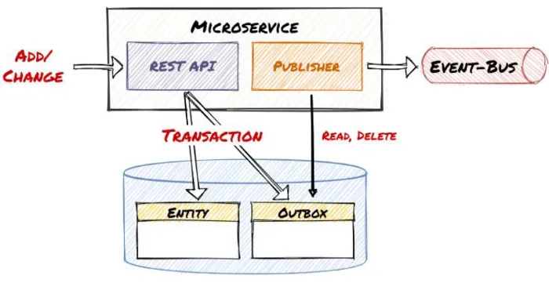
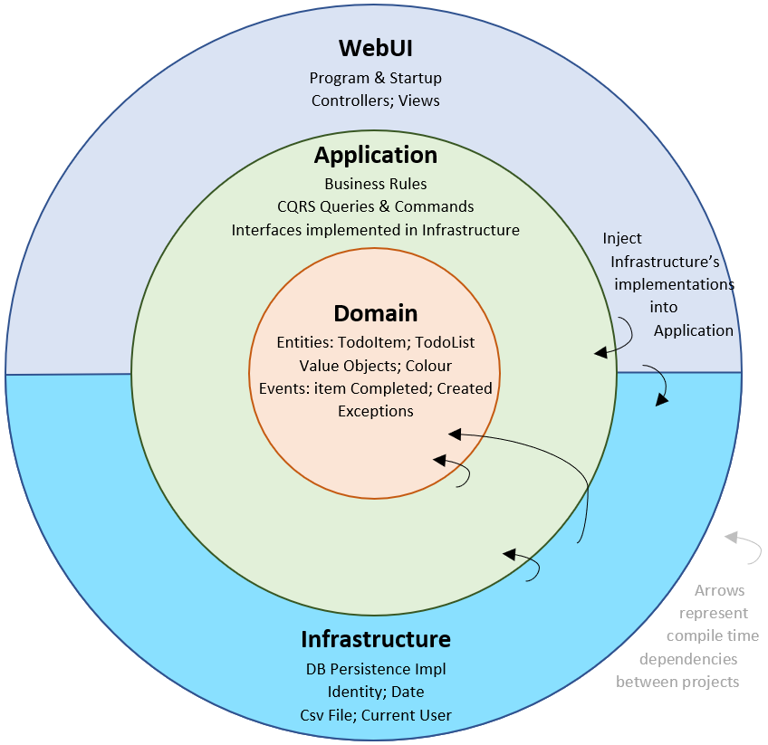
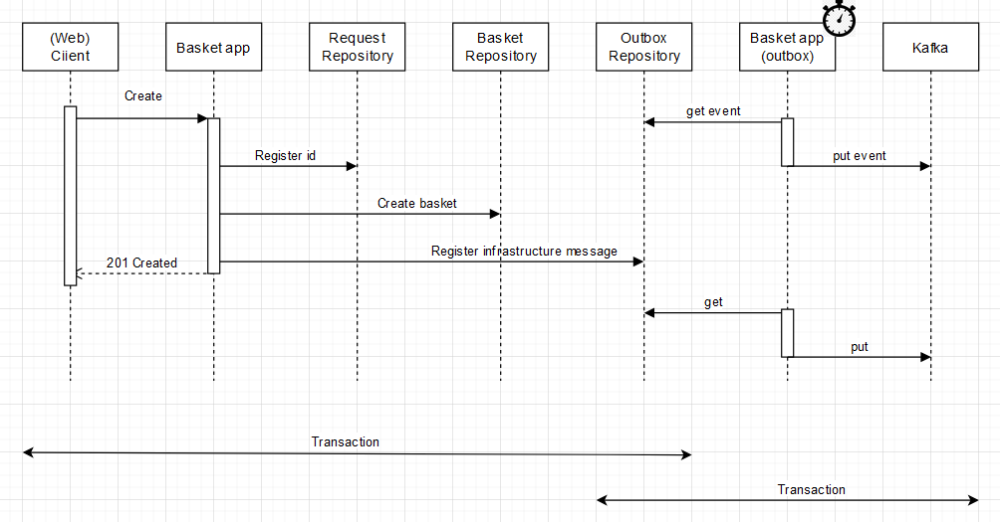

# The Outbox Pattern

This project implements the Outbox pattern and demonstrates multiple architectural choices:

- Outbox: ensures data consistency and reliability by preventing that an event is published but the database state is
  not saved
- Idempotence: is applied for increased consistency
- CQRS: is applied to separate concerns and increased scalability
- Domain Events: the business logic distributes application events for low coupling and increased extensibility
- Integration events: basket domain communicated through integration events for low coupling

## Outbox

In simple terms, when your API generates event messages, it doesn't send them out immediately. Instead, the messages are
stored in a database table. Later, a scheduled job retrieves these messages and publishes them to the message broker
system at specified intervals. This is illustrated here:

## Idempotence

When you send a command to the basket application in this project, it uses a command bus to distribute it to the handler
for that command. In the process it stores the command in a repository with an ID that identifies the command. This
ensures that the command is not executed twice. It also serves as an audit log.

## CQRS

Commands use the command bus for distribution, but queries are executed directly, possibly against denormalized data
adapted to the users use cases.

## Domain Events

Events ensure decoupling and scalability by allowing new functionality to be created without changing the existing
functionality. Events also increase observability and provide a natural point for logging and monitoring.

## Integration Events

Integration events are sent through Kafka that scales well and also ensures durability and availability.

# The Clean Architecture

The Clean architecture as it should be:

# Sequence Diagram for this 

A sequence digram for this application:

